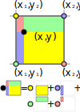
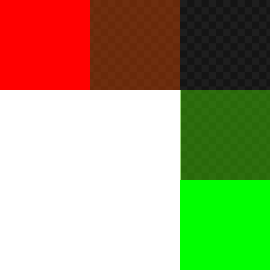

# alpha-bleed

A tool written in rust to bleed an image's border colors into their transparent neighbors. It's primarily intended for use in applications that use bilinear filtering.

## Bilinear Filtering

A very common method for scaling images up and down is bilinear filtering. Each pixel in the new image is mapped to the original image space. This often results in coordinates that land somewhere in-between the original pixels (i.e. floats as opposed to ints). The converted coordinates are then used to find the closest neighboring pixels (ints). Finally, by weighing the area between each neighbor an interpolated pixel is achieved for the new images.

```luau
local widthScale = oldWidth / newWidth
local heightScale = oldHeight / newHeight

for i = 0, newHeight - 1 do
	for j = 0, newWidth - 1 do
		local y = i * heightScale
		local x = j * widthScale

		local x1 = math.floor(x)
		local x2 = math.min(oldWidth - 1, math.ceil(x))
		local y1 = math.floor(y)
		local y2 = math.min(oldHeight - 1, math.ceil(y))
	end
end
```

[](https://commons.wikimedia.org/w/index.php?curid=21409164)

## The problem?

This is a flawed approach. It makes sense when every pixel is fully opaque, but not when transparency is involved.

For example, say we have a red and green pixel and we want to interpolate between the two.

$$
 \begin{bmatrix}
255 \\
0 \\
0 \\
255
\end{bmatrix}\to \begin{bmatrix}
? \\
? \\
? \\
?
\end{bmatrix}\leftarrow  \begin{bmatrix}
0 \\
255 \\
0 \\
255
\end{bmatrix}
$$


The result would be:

$$
 \begin{bmatrix}
255 \\
0 \\
0 \\
255
\end{bmatrix}\to \begin{bmatrix}
127.5 \\
127.5 \\
0 \\
255
\end{bmatrix}\leftarrow  \begin{bmatrix}
0 \\
255 \\
0 \\
255
\end{bmatrix}
$$


Now let's imagine that the green pixel is fully transparent. If we do the interpolation this time we get a value that visually doesn't make sense. The green is still having an impact on the final result!

$$
 \begin{bmatrix}
255 \\
0 \\
0 \\
255
\end{bmatrix}\to \begin{bmatrix}
127.5 \\
127.5 \\
0 \\
127.5
\end{bmatrix}\leftarrow  \begin{bmatrix}
0 \\
255 \\
0 \\
0
\end{bmatrix}
$$


## Alpha Bleeding

This tool helps mitigate the issue by finding all the pixels in the image that are not fully transparent, but that do have a fully transparent neighbor. It then bleeds out the r, g, and b channels into those fully transparent neighbors.

This results in a process that looks like this:

1. 
2. 
3. 
4. 

A key difference of this tool compared to other alpha bleeding tools is that instead of bleeding into the entire image we only bleed one pixel.


We only care about cases when bilinear filtering results in a pixel that's not fully transparent and as such we don't need to bleed into every transparent pixel. In fact we actually save a bit on memory since the file can be compressed more efficiently.

## In Action

Let's see what this does to our end result with a few example. First let's revisit the red with transparent green example.

$$
 \begin{bmatrix}
255 \\
0 \\
0 \\
255
\end{bmatrix}\to \begin{bmatrix}
? \\
? \\
? \\
?
\end{bmatrix}\leftarrow  \begin{bmatrix}
0 \\
255 \\
0 \\
0
\end{bmatrix}
$$

We'd run alpha bleed on this which would result in the red bleeding into the green pixel and overwriting it:

$$
 \begin{bmatrix}
255 \\
0 \\
0 \\
255
\end{bmatrix}\to \begin{bmatrix}
? \\
? \\
? \\
?
\end{bmatrix}\leftarrow  \begin{bmatrix}
255 \\
0 \\
0 \\
0
\end{bmatrix}
$$

Then when we bilinear interpolate the middle pixel we get:

$$
 \begin{bmatrix}
255 \\
0 \\
0 \\
255
\end{bmatrix}\to \begin{bmatrix}
127.5 \\
0 \\
0 \\
127.5
\end{bmatrix}\leftarrow  \begin{bmatrix}
255 \\
0 \\
0 \\
0
\end{bmatrix}
$$


Great! That's the result we'd expect!

However, alpha bleeding doesn't actually perfectly solve the issue. For example, let's imagine this is our image and we are going to bleed into the transparent pixel.


In this case we get the same yellowish color as before. However, if we bilinear filter a new pixel between either the red or gree we're using this yellowish color as part of the calculation which looks wrong:



*It's not terrible, but it's not accurate either.*

## Real Solutions?

A better way of handling this would be for the graphics pipeline to support pre-multiplied alpha images. This means instead of storing pixels as:

$$
 \begin{bmatrix}
r \\
g \\
b \\
a
\end{bmatrix}
$$

Instead they get stored as:

$$
 \begin{bmatrix}
r * a \\
g * a \\
b * a \\
a
\end{bmatrix}
$$

This causes the bilinear filtering result to be properly weighed. However, changes must also be made to the graphics pipeline to support this.

```
-- typical blend equation
result.rgb = (foreground.rgb * foreground.a) + (background.rgb * (1 - foreground.a))

-- pre-multiply support
result.rgb = foreground.rgb + (background.rgb * (1 - foreground.a))
```

It also means that images must be stored at a higher bit depth. For example, 8bit depth images would now need to be stored as 16bit depth images so that precision isn't lost.

Alternatively you might suggest making a modification to the bilinear filtering algorithm itself to properly weigh the alpha channel. However, this has a performance cost since we'd need to do quite a few more multiplications and inevitably have to temporarily convert to a higher bit depth as part of the process.